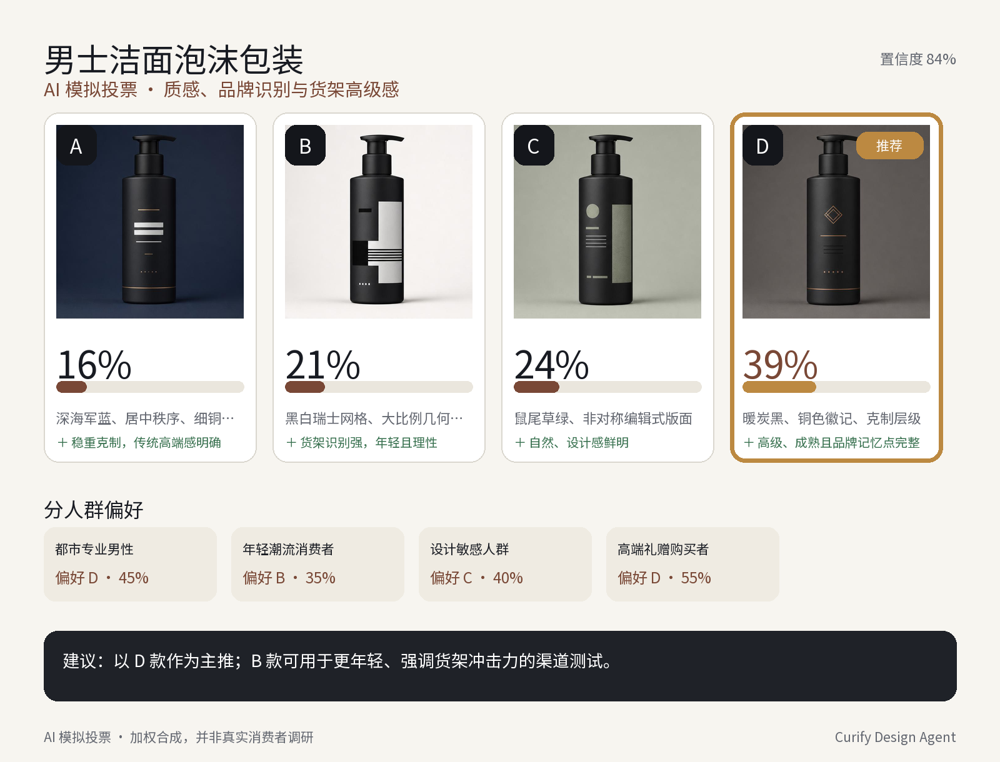

# Design Agent v0

Curify Design Agent 的首个可评测后端垂直切片：把「图片 + 一次文字指令」
收敛为有界的 `UNDERSTAND → PLAN → GENERATE → VERIFY → REPAIR → PRESENT`
执行链，并记录每一步 trace。

## v0 能力

1. **design-vote**：输入一张 A–D 四宫格或四张候选图，输出 AI 模拟投票、
   分人群依据、排名、建议、结构化 JSON 和确定性渲染的中文决策图。
2. **tryon-poster**：输入自拍、可选商品参考图和指令，输出 1–4 张电商试穿海报；
   对身份、商品保真、肢体、指令遵循和版式做视觉复核，只重试失败海报。

两条路径都具备 capability/abstention、付费生成权限门、0–2 次有界重试、
输入图片安全检查与 artifact contract。模拟投票始终标注为 AI 模拟，
不会虚构样本量或真实消费者调查。

## 目录

| 路径 | 内容 |
|---|---|
| [`SPEC.md`](SPEC.md) | **仅指针**——规范正文在 `curify-studio/docs/design-agent-v0-spec.md`（本仓库曾存一份分叉，停在 §7，已落后约 1,500 行） |
| [`curify-integration/`](curify-integration/) | 新增 runtime/router/test 源码快照，以及可应用到 Curify 的完整 patch |
| [`demo/`](demo/) | 男士理容四方案投票输入、脚本与真实输出 |
| [`eval/`](eval/) | 单轮黑盒 agent eval、routing benchmark、21 条真实多模态 query、参考图素材包、完整性校验与版本化 live 实验快照 |
| [`factory/`](factory/) | 图片到刀线、CMYK/PDF、spec 和生产 ZIP 的贴纸 exporter |
| [`benchmarks/`](benchmarks/) | 创意探索 benchmark 案例 |

> **仓库分工**：`curify-studio` / `curify-frontend` 放**生产代码与规范文档**；
> 本仓库放**评测、数据、轨迹**（benchmark、数据集、实验快照、factory exporter、集成 patch）。
> 规范与它所规范的产品同仓，证据与它所支撑的结论同仓。

## 男士理容投票 demo

请求：

~~~json
{
  "task_type": "design_vote",
  "prompt": "站在消费者角度，哪款男士理容包装更有质感？",
  "image_urls": ["images/uploads/42/board.jpg"],
  "max_iterations": 1
}
~~~

本次结果：**D 方案 39% 排名第一**，verifier 通过，执行 1 轮、记录 9 个
trace steps。完整结果见 [`run-result.json`](demo/output/run-result.json)。

该 demo 没有调用付费模型或 GCS：`DemoVisionGateway` 和本地 artifact store
替代外部边界；路由、规划、tool registry、聚合、渲染、验证、呈现与 trace
均走 production v0 runtime。

### 重新运行

先在一份干净的 `curify-studio` checkout 上应用集成 patch：

~~~bash
git -C /path/to/curify-studio apply --check \
  /path/to/agentic-adhoc/design-agent-v0/curify-integration/design-agent-v0.patch
git -C /path/to/curify-studio apply \
  /path/to/agentic-adhoc/design-agent-v0/curify-integration/design-agent-v0.patch

cd /path/to/curify-studio/curify_background
CURIFY_BACKEND_ROOT="$PWD" \
  python /path/to/agentic-adhoc/design-agent-v0/demo/run_demo.py
~~~

## 验证与评测

应用 patch 后运行 13 个隔离测试：

~~~bash
cd /path/to/curify-studio/curify_background
python -m unittest discover -s tests -p 'test_design_agent_runtime.py' -v
~~~

对已启动的后端执行单轮端到端黑盒评测：

~~~bash
CURIFY_EVAL_TOKEN='<token>' \
python design-agent-v0/eval/runtime_eval.py \
  --cases design-agent-v0/eval/runtime_cases.example.jsonl \
  --base-url http://localhost:8000
~~~

评测覆盖 route、abstention/status、stage coverage、visual verdict、retry budget
与 artifact 可达性，并按 `coverage` 聚合 routing accuracy 和缺口。

### 真实参考图素材包

`eval/assets/reference-pack-v0.1/` 包含 18 张项目自有 PNG（17 张生成图和 1 张
已有男士理容 A–D 图），覆盖海报编辑、设计投票、试穿、生产文件、Logo 升级、
商品精修、详情页替换和 SKU 系统。`eval/queries.jsonl` 已为 9 条严格图片必需的
routing query 与 12 条 image-bearing agent-route query 建立 30 个显式素材绑定。

~~~bash
cd design-agent-v0
python3 eval/reference_asset_eval.py
~~~

当前校验结果为 21/21 query、18/18 素材通过；检查范围包含解码、尺寸、SHA-256、
隐私标记和透明贴纸 alpha。完整生成提示词保存在素材包的 `PROMPTS.md`。

## 当前边界

- 已有合法、项目自有的真实像素 fixtures；线上 Vision/生成 benchmark 仍需 Gemini
  与私有 GCS 配置。
- trace 目前持久化到 Curify `Project.runtime_config` 并输出结构化日志；
  LangWatch/Langfuse/Braintrust/Phoenix exporter 是下一步可插拔接线。
- 异步执行沿用 FastAPI `BackgroundTasks`；放量前应切到 durable worker/queue。
