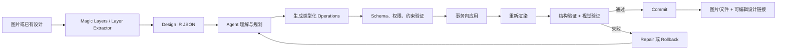

# Canva Magic Layers 与 Agent 结构化设计操作调研

> 调研日期：2026-08-26
>
> 目的：判断 Magic Layers 对 Curify Design Agent 的启发，以及 Agent 应如何安全地操作设计 JSON。

## 结论

Canva Magic Layers 可以理解为一个“逆向设计编译器”：输入扁平的 JPEG/PNG，恢复为带有
可编辑文字、独立对象、背景和布局关系的设计文档。它解决的是**像素到结构**的问题；
Agent 继续编辑设计时，解决的是**意图到受控结构变更**的问题。

公开接口并不允许 Agent 下载并任意重写 Canva 内部 JSON。Canva 提供的是两种受控模型：

1. 外部 Agent 通过 Canva MCP 执行“开启事务 → 读取可编辑元素 ID → 提交 operations →
   检查结果 → commit/cancel”；
2. Canva 编辑器内 App 通过 Apps SDK 操作页面 snapshot，最后调用 `sync()`。

对 Curify 最合适的实现不是复刻 Canva 私有文件格式，而是建立平台无关的 Design IR：

- `design_document.json`：当前对象图和版本；
- `change_set.json`：Agent 提议并实际执行的局部 operations；
- `verification.json`：结构与视觉后置条件；
- `trajectory.jsonl`：可观察的规划、工具调用、验证、提交和恢复事件。

这与当前 [`brief_bank`](../brief_bank/README.md) 的 L3/L4 structured-artifact contract
一致，可以直接演进，而不需要新建一套评测协议。

## 1. Magic Layers 做什么

Canva 在 2026 年 3 月推出 Magic Layers。官方描述的能力包括：

- 将扁平、静态图片转换成 Canva 内的多层可编辑设计；
- 将图片中文字恢复成 live text box；
- 将对象识别为可单独选择、移动和调整的元素；
- 保留或补全背景，并尽量维持原始布局关系；
- 拆层后继续换字体、改颜色、缩放、重排、动画和多尺寸适配。

它由 Canva 自研的 Canva Design Model 驱动，不只是传统的轮廓描摹。Canva 的
[发布说明](https://www.canva.com/newsroom/news/magic-layers/)强调模型会整体理解文字、对象、
背景和布局关系；[产品页](https://www.canva.com/magic-layers/)建议使用 JPEG/PNG，并说明
Magic Layers 属于会消耗月度 AI allowance 的 premium AI tool。

发布时它首先以 public beta 覆盖美国、英国、加拿大和澳大利亚；此后 Canva 宣布可在
ChatGPT 和 Gemini 中通过 Canva Connector 将生成图片转为可编辑 Canva 设计。不同入口、
地区、账户和套餐的实际可用性仍应在运行时检查，不能只依赖静态产品说明。
[Canva AI assistants 公告](https://www.canva.com/newsroom/news/magic-layers-ai-assistants/)

### 公开信息没有说明什么

Canva 没有公开 Magic Layers 的模型结构、训练数据、内部 document schema，也没有公开一个
“输入图片、返回完整 Canva layer JSON”的通用 API。因此下面这条可能的处理链只能视为基于
官方产品行为和公开研究的工程推断，而不是 Canva 已确认的内部实现：

```text
扁平图片
  → OCR 与文字样式识别
  → 实例分割、对象抠图与 alpha mask
  → 遮挡区域背景补全
  → 图层层级、分组和布局关系恢复
  → 原生可编辑设计文档
```

公开研究提供了相似但非 Canva 专属的参考：

- [COLE](https://arxiv.org/abs/2311.16974) 先把设计意图转换成描述图层、位置、样式和内容的
  JSON，再按背景、对象、文字逐层生成；
- [CreatiPoster](https://arxiv.org/abs/2506.10890) 使用 JSON 规格描述每个文字/资产层、布局、
  层级和背景提示词。

## 2. Agent 操作 Canva 的公开路径

| 路径 | Agent/应用获得的能力 | 适合场景 | 主要边界 |
|---|---|---|---|
| Canva Remote MCP | 设计生成、受控编辑、资产、品牌、导出、评论 | ChatGPT、Claude、自建 Agent | 工具事务，不暴露完整内部 JSON |
| Canva Apps SDK / Design Editing API | 页面 snapshot、元素 CRUD、分组、`sync()` | Canva 编辑器侧栏 App | 仅能操作 API 支持的页面和元素 |
| Canva Connect APIs | 设计/资产管理、创建、导入、导出、Autofill | 后台系统集成 | 不是任意 layer-tree 编辑接口 |

Canva 明确说明 Apps SDK 没有对底层 document model 的无限制访问权，只能使用公开 API
暴露的控制面。[Apps SDK 技术边界](https://www.canva.dev/docs/apps/integrating-canva/)

### 2.1 Canva MCP 的事务模型

Canva Remote MCP 地址为 `https://mcp.canva.com/mcp`。官方工具列表包含：

- `start-editing-transaction`
- `perform-editing-operations`
- `commit-editing-transaction`
- `cancel-editing-transaction`
- `get-design-thumbnail`

完整能力和套餐边界见 [Canva MCP 文档](https://www.canva.dev/docs/mcp/) 与
[MCP tools/rate limits](https://www.canva.dev/docs/mcp/tools/)。
接入方应在运行时通过 MCP `tools/list` 读取实际 input schema，不应把文档示例或当前工具集
永久硬编码进 Agent。

标准路径如下：

```text
start-editing-transaction
  → 获得 transaction_id、page、richtexts、fills、element_id、thumbnail
  → Agent 将自然语言要求解析成针对 element_id 的 operations
  → perform-editing-operations
  → 检查每项 edit_operation_results.status
  → 重新读取 thumbnail / 可编辑状态并验证
  → commit-editing-transaction 或 cancel-editing-transaction
  → 返回 edit_url 供用户继续人工编辑
```

`start-editing-transaction` 返回的简化结构如下。可编辑 `element_id` 来自事务响应，
而不是普通的 `get-design-content`：

```json
{
  "transaction": {
    "status": "open",
    "transaction_id": "TXN_123"
  },
  "richtexts": [
    {
      "page_index": 1,
      "element_id": "TITLE_01",
      "regions": [
        {"type": "character", "text": "男士理容产品"}
      ]
    }
  ],
  "fills": [
    {
      "page_index": 1,
      "element_id": "PRODUCT_IMAGE_01",
      "asset_id": "ASSET_123",
      "editable": true
    }
  ]
}
```

文字替换 operation 示例：

```json
{
  "transaction_id": "TXN_123",
  "page_index": 1,
  "operations": [
    {
      "type": "replace_text",
      "element_id": "TITLE_01",
      "text": "AI 模拟投票：方案 B 胜出"
    }
  ]
}
```

运行时必须检查每项结果，而不能因为工具调用没有抛异常就宣布成功：

```json
{
  "edit_operation_results": [
    {
      "status": "success",
      "operation_info": {
        "type": "replace_text",
        "element_id": "TITLE_01"
      }
    }
  ]
}
```

其他公开注意事项：

- 当前公开示例明确展示文字和 fill 类编辑；不能假设 Curify Design IR 的每种 operation
  都能一对一映射成同名 Canva MCP operation，应以 `tools/list` 返回的 schema 为准；
- responsive page 使用 `find_and_replace_text`，而不是依赖固定元素位置；
- 替换图片不能直接传原始 URL，应先通过 `upload-asset-from-url` 得到 `asset_id`；
- edit operation 保持 draft，只有 commit 成功才算保存；
- 如果用户在浏览器同时编辑，旧 transaction snapshot 可能失效，此时应取消旧事务、重新
  start、重新解析 element ID、重放仍然适用的 operations，再 commit；
- Agent 完成编辑后应返回 Canva `edit_url`，而不是只返回静态 export。

参见 [start transaction](https://www.canva.dev/docs/mcp/tools/start-editing-transaction/)、
[perform operations](https://www.canva.dev/docs/mcp/tools/perform-editing-operations/)、
[commit transaction](https://www.canva.dev/docs/mcp/tools/commit-editing-transaction/) 和
[design edit handoff](https://www.canva.dev/docs/mcp/workflows/design-edit/)。

### 2.2 Apps SDK 的 snapshot 模型

Canva 编辑器内 App 可以用 `openDesign` 打开 `current_page` 或 `all_pages` context，在 callback
中读取 snapshot、修改受支持元素，最后调用 `sync()`。官方建议将多个修改批量执行后只
sync 一次，以减少延迟、限流和多余的 undo steps。

其中 `all_pages` 当前属于 preview；Design Editing API 只支持 absolute pages，不能据此假设
Canva Docs 等所有页面类型都可编辑。

API 支持对一部分元素执行 CRUD；所有元素共有 `top`、`left`、`width`、`height`、
`rotation`、`transparency`、`locked` 等属性。图片/视频在该 API 中表现为带 media fill
的 rect，而不是独立 image/video element。页面或元素 locked 时只能读不能改。

这条路径比 Remote MCP 更适合实现 Canva 编辑器内的自定义 Design Agent，但仍然不是自由
读写 Canva 私有 JSON。[Design Editing API](https://www.canva.dev/docs/apps/design-editing/)

## 3. Curify 的 Design IR 建议

LLM 不应重写完整设计 JSON。完整重写容易造成：

- 稳定对象 ID 丢失；
- 未授权图层被顺带修改；
- 数组下标变化导致修改错对象；
- 覆盖用户并发修改；
- diff、审计和恢复困难；
- 上下文和 token 成本随文档大小增长。

推荐将状态和动作分开：Runtime 持有真实文档，Agent 只返回符合 JSON Schema 的小范围、
类型化 operations。

### 3.1 `design_document.json`

以下是 Curify 建议格式，不是 Canva 官方 schema：

```json
{
  "schema_version": "design-ir-v1",
  "document_id": "mens-grooming-vote",
  "revision": 12,
  "canvas": {"width": 1080, "height": 1350},
  "elements_by_id": {
    "headline": {
      "type": "text",
      "role": "headline",
      "text": "哪款包装更有质感？",
      "frame": {"x": 80, "y": 60, "w": 920, "h": 100},
      "locked": false
    },
    "candidate_a": {
      "type": "image",
      "role": "vote_candidate",
      "asset_ref": "asset-a",
      "frame": {"x": 80, "y": 220, "w": 420, "h": 420},
      "locked": true
    }
  },
  "z_order": ["candidate_a", "headline"],
  "constraints": {
    "preserve_ids": ["candidate_a"],
    "safe_margin": 48
  }
}
```

设计要点：

- `elements_by_id` 使用稳定 ID，避免让 Agent 依赖 `/elements/3` 之类的数组位置；
- `z_order` 与元素数据分离，重排层级不需要重写全部对象；
- `role` 提供 `headline`、`logo`、`product`、`candidate` 等语义选择器；
- `locked` 和 `constraints` 由 Runtime 强制执行，不能只依赖 prompt；
- `revision` 用于 optimistic concurrency control；
- asset 通过不可变 `asset_ref`、hash 和 provenance 绑定，不在 JSON 内嵌大文件或短期签名 URL。

### 3.2 `change_set.json`

```json
{
  "schema_version": "design-change-set-v1",
  "base_revision": 12,
  "intent": "render_vote_result",
  "operations": [
    {
      "op": "replace_text",
      "target_id": "headline",
      "text": "AI 模拟投票：方案 B 胜出"
    },
    {
      "op": "set_style",
      "target_id": "headline",
      "style": {
        "font_weight": 700,
        "color": "#18212B"
      }
    }
  ],
  "assertions": [
    {
      "type": "preserve",
      "target_ids": ["candidate_a"]
    },
    {
      "type": "inside_canvas",
      "target_ids": ["headline"]
    }
  ]
}
```

建议先支持一组小而闭合的原子操作：

- `replace_text`
- `replace_asset`
- `set_style`
- `set_frame`
- `insert_element`
- `delete_element`
- `reorder_element`
- `group_elements` / `ungroup_elements`

每个 operation 都应声明 `target_id`、允许修改的字段和可验证后置条件。工具 adapter 再把
这些中立 operation 翻译成 Canva MCP、Canva Apps SDK、Curify renderer 或其他 Agent 的
平台操作。

## 4. Runtime 执行与验证闭环



### 提交前验证

- JSON Schema 和 operation allowlist 合法；
- `base_revision` 等于当前 revision；
- `target_id` 存在且元素未锁定；
- 用户请求允许修改该字段和资产；
- operation 不越界、不引入非法字体/颜色/资源；
- 批量操作可以在同一事务中原子完成。

### 应用后验证

- 每个 operation 均返回 success；
- 指定对象发生预期变化；
- `preserve_ids` 对象及未授权区域没有 collateral changes；
- 没有文字溢出、遮挡、错误层级、丢图或画布越界；
- OCR、对象数、尺寸、文件格式和输出数量满足 artifact contract；
- 重新渲染结果满足 brief 和视觉质量阈值；
- hard gate 通过后才能 commit/present，否则 repair 或 rollback。

`verification.json` 应同时保存 object-graph diff 和 render evidence，不能只存一句 LLM
自评；`trajectory.jsonl` 应记录 observable action/event，不记录私有 chain-of-thought。

## 5. 对 Curify 当前框架的映射

| Canva/Magic Layers 概念 | Curify 建议产物或组件 |
|---|---|
| flat image decomposition | `layer_extractor` / `design_object_inspector` |
| native layered document | `design_document.json` |
| editable element ID | stable object ID + semantic role |
| editing transaction | Runtime project/version transaction |
| editing operations | `change_set.json` |
| thumbnail/render preview | `preview.png` 与分阶段 render evidence |
| commit/cancel | hard-gated commit / rollback |
| human edit handoff | editable artifact URL/file + final preview |
| observable MCP calls | `trajectory.jsonl` tool events |

这补齐了 Curify 早期“图片 → prompt → 重新生成整张图片”的缺口：

```text
现有弱路径：图片 → prompt → 重新生成图片

目标路径：图片 → 对象化 Design IR → 局部 operations
        → 确定性应用 → 重渲染 → object diff + visual verify
```

## 6. 建议新增的评测指标

| 指标 | 测量内容 | 主要证据 |
|---|---|---|
| `layer_recovery_coverage` | 应拆出的文字/对象有多少成为独立层 | 标注对象与恢复对象匹配 |
| `text_recovery_exact_match` | 文字内容是否完整恢复 | OCR/live text 对照 |
| `layout_fidelity` | 拆层前后布局关系是否保持 | bbox、层级与渲染比较 |
| `mask_alpha_quality` | 抠图边缘和透明通道质量 | mask IoU、边缘 artifact |
| `background_completion_quality` | 移动物体后背景是否合理 | 移动/隐藏 layer 后的 render |
| `targeted_edit_success` | 请求的局部修改是否完成 | operation postcondition + VLM |
| `collateral_change_rate` | 未授权对象或像素被改变的比例 | object diff、区域 pixel diff |
| `editability_coverage` | 输出中真正可编辑的对象比例 | live text、fill、shape 检查 |
| `transaction_commit_success` | edit 是否经过验证并可靠保存 | transaction/commit trace |

这些指标可与现有 Design Agent Benchmark 维度组合：

- Brief adherence：`targeted_edit_success`；
- Refinement ability：目标 delta 正确率与 `collateral_change_rate`；
- Brand consistency：token、字体、颜色和受保护对象保持；
- Cross-asset consistency：多画布对象 ID、品牌 token 和资产绑定一致；
- Production readiness：对象图合法、文件可编辑、导出规格通过；
- Efficiency：操作数、repair 次数、事务失败率、延迟和成本。

## 7. 推荐实施顺序

1. 固化 `design-ir-v1`、`change-set-v1` 与 JSON Schema，复用现有四类 structured artifacts。
2. 先实现 `replace_text`、`set_frame`、`replace_asset` 三种操作及 deterministic renderer。
3. 加入 stable object ID、revision、locked fields 和事务 commit/rollback。
4. 用现有 SUMMER FORM localized-edit case 验证“只改标题和 event mark，其他对象保持”。
5. 增加 object diff、区域 pixel diff、OCR、overflow 和 overlap verifier。
6. 把 Canva MCP 作为一个 adapter，而不是把 Canva 私有结构当作 Curify 核心 schema。
7. 再用相同 Dataset/Design IR contract 对比 Curify、Canva 和其他 Design Agent。

## 8. 关键判断

Magic Layers 最重要的价值不是“多了一种图片编辑效果”，而是把设计 Agent 的工作对象从
不可解释的像素，提升为可寻址、可约束、可验证、可回滚的对象图。

对 Curify 而言，正确的职责分工是：

> 模型负责理解意图并产生最小变更；Runtime 掌握真实文档状态、执行变更，并证明变更正确。

## 参考资料

- [Canva: Introducing Magic Layers](https://www.canva.com/newsroom/news/magic-layers/)
- [Canva: Magic Layers product page](https://www.canva.com/magic-layers/)
- [Canva: Magic Layers in AI assistants](https://www.canva.com/newsroom/news/magic-layers-ai-assistants/)
- [Canva MCP documentation](https://www.canva.dev/docs/mcp/)
- [Canva MCP tools and rate limits](https://www.canva.dev/docs/mcp/tools/)
- [Canva MCP: start-editing-transaction](https://www.canva.dev/docs/mcp/tools/start-editing-transaction/)
- [Canva MCP: perform-editing-operations](https://www.canva.dev/docs/mcp/tools/perform-editing-operations/)
- [Canva MCP: commit-editing-transaction](https://www.canva.dev/docs/mcp/tools/commit-editing-transaction/)
- [Canva Apps SDK: Design Editing API](https://www.canva.dev/docs/apps/design-editing/)
- [COLE paper](https://arxiv.org/abs/2311.16974)
- [CreatiPoster paper](https://arxiv.org/abs/2506.10890)
